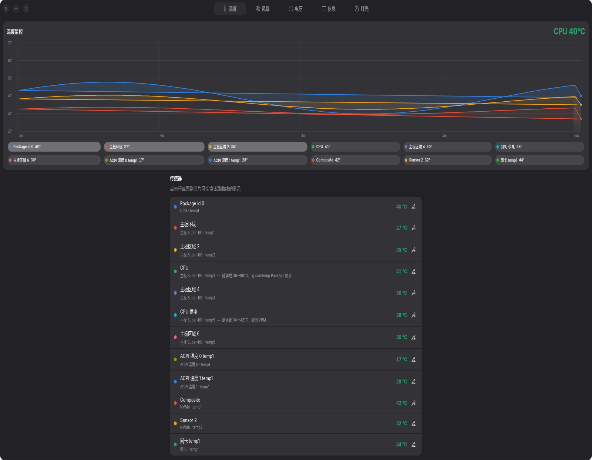
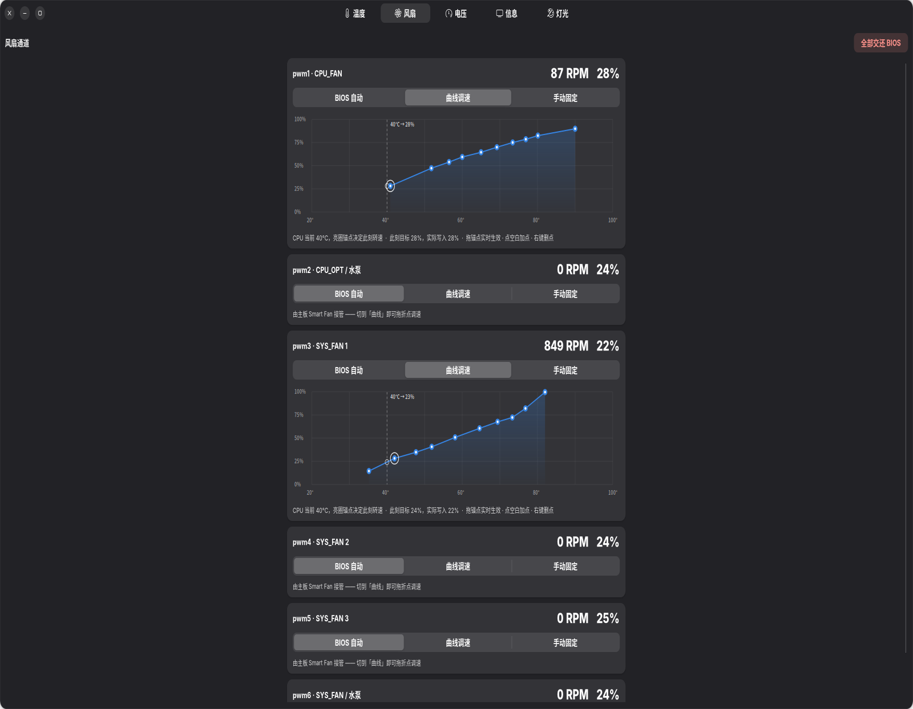
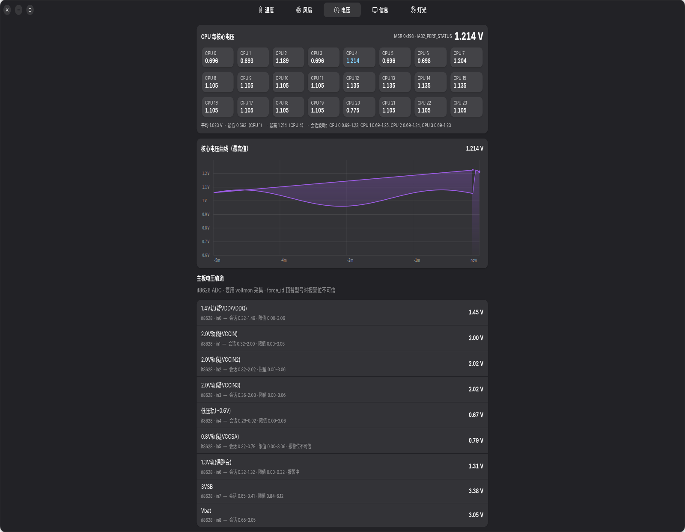
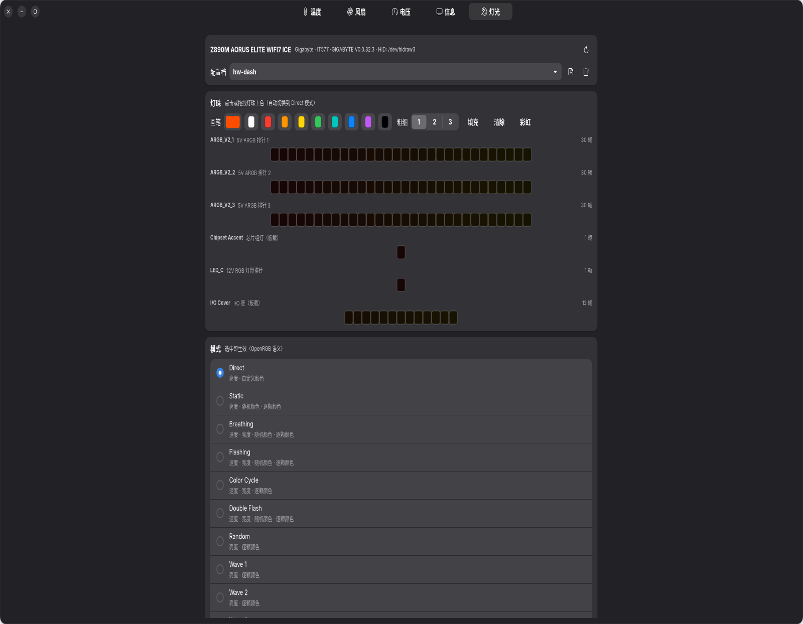
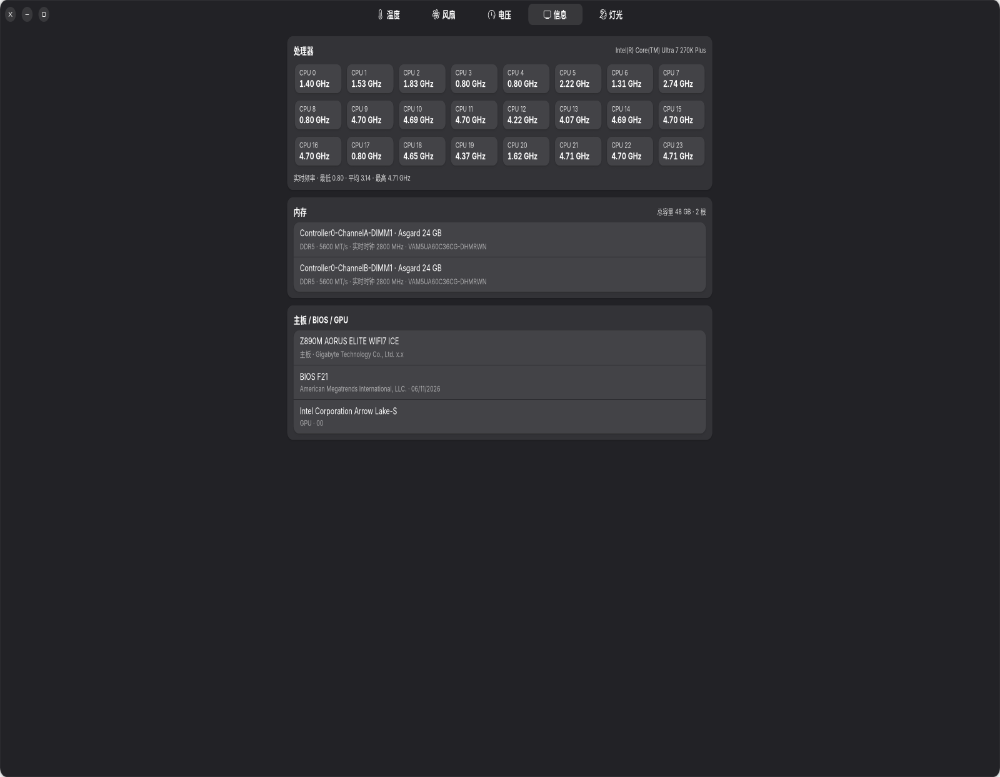

# 硬件面板 hw-dash · Hardware Panel **for Linux**

> **For Linux only · 仅支持 Linux。** GTK4 + libadwaita 原生桌面应用：温度曲线监测、风扇曲线调速、每核心电压、系统信息、主板 RGB 灯光控制 —— 一块面板管全所有硬件。

一个真正的**原生** GTK4 应用（不是网页套壳）：左侧五页签，2 秒轮询刷新，所有硬件读写经系统守护进程完成，界面永不冻结。



## ✨ 功能总览

### 🌡️ 温度
- 风格化的**渐变填充曲线大图**：每颗传感器一条曲线，最近 5 分钟历史，主题配色随温区变色（绿→黄→红）
- **可点击图例芯片**：点哪条显哪条，最多同屏多曲线对比
- 传感器列表：实时温度、芯片限值、状态色标注
- CPU 封装温度常驻头部

### 🌀 风扇
- **卡片式通道列表**：每个 PWM 通道一张卡（CPU_FAN / 水泵 / SYS_FAN…），实时转速 + 占空比
- **三种模式一键切换**：
  - **BIOS**：交还主板 Smart Fan 控制
  - **曲线**：直接在图上拖拽锚点编辑 温度→占空比 曲线
  - **手动**：拉滑块恒速
- **曲线编辑器**：
  - 左键按住锚点拖动、空白处点击新增（最多 10 点）、右键删除
  - 拖动过程中 **250ms 节流即时下发** —— 转速实时跟随，不用等松手
  - 距当前温度最近的锚点画**亮圈**：它决定此刻的转速
  - 每 2 秒自动重放曲线，温度爬进新区间转速自动跟上
- **「设备或资源忙」自恢复**：it87 驱动在 BIOS 自动模式下拒绝手动占空比，守护进程启动时自动重新断言手动模式，应用失败也会限频自愈
- 退出守护进程时主动把 PWM 寄存器交还 BIOS

### ⚡ 电压
- **每核心电压**：逐逻辑 CPU 读 `MSR 0x198`（IA32_PERF_STATUS，CPU 自报瞬时 VID，分辨率 1/8192 V）——与 HWiNFO/XTU 同源
- 24 块核心瓷砖一屏展示，当前最高核主题色高亮；会话 min/max 汇总
- **VCore 曲线**：最近 5 分钟每核最高值走势，y 轴自适应
- **主板电压轨道**：Super-I/O（如 IT8628）全部 ADC 通道，与基准测试台面板/CLI 同源读数；每条带会话区间、芯片限值与报警位
- 报警位不可信标注（force_id 顶替型号时常见误报）

### 💻 信息
- 处理器：型号 + **每逻辑 CPU 实时频率瓷砖**（cpufreq）+ 最低/平均/最高汇总
- 内存：每根内存条一行（DMI）——插槽、厂商、容量、配置速率与**实时时钟频率**
- 主板 / BIOS / GPU 概览

### 🎨 灯光（OpenRGB 交互范式）
- 复用已装的 **OpenRGB**：纯 Python 实现的 SDK 客户端（协议 v3 + v6），零第三方依赖
- **模式列表**：按设备 flags 动态生成参数区——颜色数组（取色器 ×N + 随机按钮）、速度 / 亮度滑杆、方向切换；选中即生效
- **逐颗渐变编辑器**：每条灯带一块画布，画笔/彩虹/清除一键填充，**150ms 节流批量下发**，自动切入 Direct 模式（与 OpenRGB 点 LED 同语义）
- **Direct 模式亮度真正可用**：IT5711 等控制器在 Direct 下不应用 brightness，守护进程按亮度系数缩放灯色重发，拖滑块立竿见影、可逆且不叠加
- **配置档**：保存 / 加载 / 删除（走 v6 本地客户端通道，与 OpenRGB 官方 profiles 完全兼容）
- 全链路异步：SDK/HTTP 调用全部在工作线程，界面零卡顿

## 🖼️ 界面一览

| 温度 | 风扇 |
| --- | --- |
|  |  |
| **电压** | **灯光** |
|  |  |
| **信息** | |
|  | |

## 🏗️ 架构

```
hw-dash（GTK4/libadwaita 界面，普通用户）
    │  HTTP 127.0.0.1:8788
    ▼
hwdashd（systemd 系统守护进程，root：MSR / sysfs PWM / SDK）
    ├─ hwhw.py          硬件抽象层：hwmon PWM/转速/温度、MSR 电压
    │    └─ voltmon     电压轨道采集（与本仓库分离的通用模块，可选）
    └─ openrgb_sdk.py   OpenRGB SDK 纯 Python 客户端（v3 控制通道 + v6 配置档通道）
```

- **界面与硬件分离**：界面崩溃/重启不影响风扇与灯光的既有策略；守护进程退出时把 PWM 交还 BIOS
- **只写一次 PWM**：守护进程是全机唯一的 PWM 写者（与 CoolerControl 等互斥由安装约定保证）

## 📦 安装（Linux）

### 依赖
- Linux + systemd（Wayland / X11 均可）
- `python3` ≥ 3.12、`python3-gi`（GTK 4 + libadwaita 1 绑定）、`python3-gi-cairo`、`python3-cairo`
- GTK4 / libadwaita 运行库（Ubuntu/Debian：`libgtk-4-1 libadwaita-1-0`）
- 风扇与电压功能：`it87` 内核模块（或你主板的对应 SIO 驱动）
- 灯光功能：[OpenRGB](https://openrgb.org)（GUI 安装即可，面板会自动拉起 `--server`）

### 步骤
```bash
# 1. 克隆到任意位置（示例放在 ~/Applications/hw-dash）
git clone https://github.com/kanghelyu/hw-dash.git ~/Applications/hw-dash

# 2. 试运行界面（只读模式，daemon 不在线也能看温度）
python3 ~/Applications/hw-dash/hwdash.py

# 3. 安装守护进程服务（编辑 hwdashd.service 中的 YOUR_USER / 路径后）
sudo cp hwdashd.service /etc/systemd/system/
sudo systemctl daemon-reload
sudo systemctl enable --now hwdashd

# 4. 皮肤 .desktop 文件（可选）
cp org.hwdash.Panel.desktop ~/.local/share/applications/   # 按需改 Exec 路径
```

> 风扇曲线功能需要你的 SIO 驱动暴露 `pwmN_enable`（it87 系列：`sudo modprobe it87 force_id=0x8628` 之类，按主板型号查）；电压轨道需要对应 hwmon 节点可读。每核心电压需要 root 读 MSR（守护进程已满足）。

## 🔧 工程实录（都是踩过的真坑）

- **OpenRGB 写命令走异步队列**：写完立即回读拿到的是上一拍的旧值 —— 守护进程在写成功后把下发值写进缓存，UI 立即见新值，服务端状态一两个周期内自然收敛
- **协议 v3 / v6 分离**：配置档读写删要求 `client_is_local_client`，仅 v6 会话经 `SET_CLIENT_FLAGS(52)+REQUEST_LOCAL_CLIENT(1<<16)` 可得 —— 配置档走独立 v6 短连接并读 ACK 确认
- **it87 EBUSY 自愈**：BIOS 自动模式拒绝手动占空比，启动时重新断言 + 应用失败限频自恢复
- **Direct 模式亮度**：控制器对灯条区只做原色直写，亮度由守护进程缩放灯色实现（可逆、不叠加）
- **VCore 不在 SIO 上**：空闲/全核/单核三态交叉验证证明主板 Super-I/O 没有任何轨道随负载变化 —— 每核心电压以 MSR 0x198 为唯一来源，轨道标签按实测语义标注
- **单实例、双通道**：面板同 id 启动自动让渡；SDK 控制通道（v3）与配置档通道（v6）各走各的

## 📄 许可证

[PolyForm Noncommercial 1.0.0](./LICENSE) —— **严格不可商用**：个人学习、自用、修改、分享完全自由；任何以商业利益或金钱补偿为主要目的的使用（销售、捆绑商用产品、公司内部生产使用等）都需要另行获得作者书面授权。**非传染性**：基于本项目的修改版没有强制开源义务，只需保留许可声明、满足非商用条件即可。

© 2026 Kanghe Lyu（kanghelyu）
